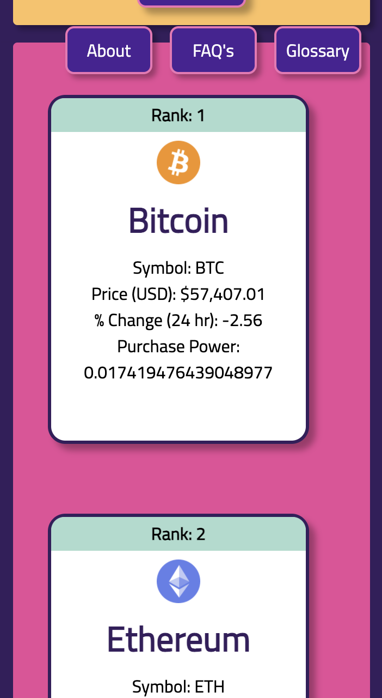
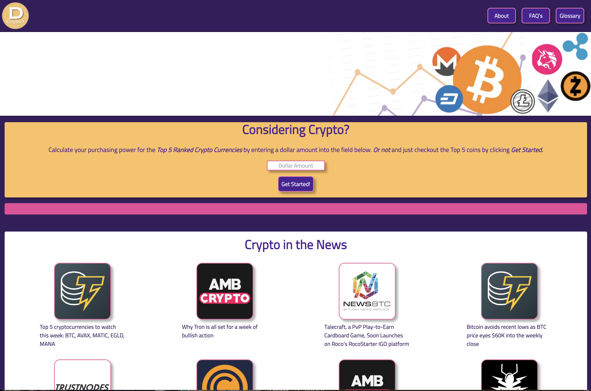

# deCrypto

## Purpose
***
**USER STORY**
&nbsp;

**AS A** person new to Cryptocurrency

**I WANT** to learn basic details about cryptocurrency

**SO THAT** I will be more knowledgeable if I choose to invest

&nbsp;

## Desired
***
**ACCEPTANCE CRITERIA**

**GIVEN** a Cryptocurrency information dashboard

**WHEN**  I  enter a valid US Dollar amount

**THEN** I am presented with top 5 cryptocurrency names, symbols, prices (USD), and percent changes in last 24 hours.

**WHEN** I enter an invalid US Dollar amount

**THEN** Purchasing Power does not display or is equal to zero.

**WHEN** I click to enter a dollar amount 

**THEN** displayed coin data is saved to local storage.

**WHEN** I refresh the page

**THEN** the previously fetched coin data persists on the page.

**WHEN** I enter a different valid US Dollar amount

**THEN** new data populates the coin data cards and is stored in local storage.

**WHEN** I click on About Button

**THEN** I am  presented with basic facts about cryptocurrency

**WHEN** I click on FAQs Button

**THEN** I am  presented with answers to commonly asked  cryptocurrency questions.

**WHEN** I click on Glossary Button

**THEN** I am  presented with definions of  cryptocurrency terms.

&nbsp;

## deCrypto URL
Decrypt crypto at *[deCrypto](https://lssdavies.github.io/deCrypto/)*

&nbsp;

## Contributors
***
Larry Davies

Mellie Dee

Mohammad Jwair

&nbsp;

## Resources and Languages Used
***
- HTML
- CSS
  - Tailwind
- JS &   jQuery
- APIs
  - api.coincap.io
  - coinlib.io/api
  - cryptoicon.api

&nbsp;

## Screen Shots
***

&nbsp;

&nbsp;

&nbsp;

&nbsp;

### Future Enhancements and Stretch Features
***
- Add list of exchanges with links
- Hide API keys
- Fetch call for icons
- Reevaluate UI and other data input flow options
- Add option to calculate for currencies other than USD
- Live market data - possible scroll effect
- Color coded data point text - green for increase red for decrease for example
- Possible linked pages for FAQs & buttons for individual glossary terms
&nbsp;

### Resource Licensing
***
&nbsp;

### Resources used or was inspired by...
***
&nbsp;

#### Web Dev References
PROXIES
https://stackoverflow.com/questions/43262121/trying-to-use-fetch-and-pass-in-mode-no-cors  

https://developer.mozilla.org/en-US/docs/Web/API/WebSocket  needed for continous like real ltime feeds of trading  ???

WHITESPACES
https://stackoverflow.com/questions/20668872/remove-whitespace-only-array-elements

#### ABOUT FAQ KEY TERMS References
https://www.banks.com/investing/crypto-banks/

https://www.banks.com/articles/investing/

https://www.coinbase.com/learn/crypto-basics/what-is-cryptocurrency

https://help.coinbase.com/en/coinbase/trading-and-funding/buying-selling-or-converting-crypto/how-do-i-sell-or-cash-out-my-digital-currency

https://www.coinbase.com/learn/crypto-basics/plp-what-is-a-blockchain?utm_source=google_search_nb&utm_medium=cpc&utm_campaign=1724683336&utm_content=113685634057&utm_term=blockchain%20explained&utm_creative=489097321868&cb_device=c&cb_placement=&cb_country=us&cb_city=open&cb_language=en_us&gclid=CjwKCAiAvriMBhAuEiwA8Cs5lfO5p_QExZZHfVL2McWoR6NPm1EDlMTqoxAThE0CgpTCzy1E-CoouBoCiCsQAvD_BwE

https://cryptoicon-api.vercel.app/ powered by Token Tax https://tokentax.co/

https://dataoverhaulers.com/purpose-point-of-cryptocurrency/cryptocurrency/convert-bitcoin-cash/

https://www.fool.com/investing/stock-market/market-sectors/financials/cryptocurrency-stocks/coin-burn/

https://www.forbes.com/advisor/investing/what-is-cryptocurrency/

https://www.forbes.com/advisor/investing/digital-currency/

https://www.investopedia.com/terms/b/blockchain.asp

https://www.investopedia.com/terms/c/cryptocurrency.asp

https://www.investopedia.com/terms/d/digital-money.asp

https://www.investopedia.com/terms/f/fiatmoney.asp

https://www.investopedia.com/terms/m/money.asp

https://www.investopedia.com/terms/v/virtual-currency.asp

https://www.investopedia.com/tech/explaining-crypto-cryptocurrency/

https://www.nasdaq.com/articles/decoding-crypto%3A-are-there-regulations-in-the-u.s.-for-cryptocurrency-2021-08-19

https://nowpayments.io/blog/whole-foods-accepts-bitcoin

https://www.ramseysolutions.com/retirement/investing-in-cryptocurrency

https://simple.wikipedia.org/wiki/Cryptocurrency

https://time.com/nextadvisor/investing/cryptocurrency/what-is-cryptocurrency/
